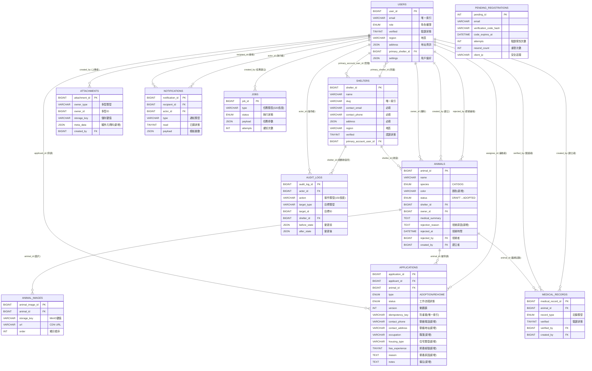

# 貓狗領養平台 - 軟體設計文件 (架構設計)

## 文件大綱

1. [系統架構概述](#系統架構概述)
2. [模組分解 (前端、後端)](#模組分解)
3. [資料庫設計](#資料庫設計)
4. [容器化部署](#容器化部署)
5. [開發與測試](#開發與測試)

---

## 系統架構概述

### 架構設計理念

本系統採用**現代三層式架構**（Presentation / Application / Data），結合微服務設計理念：

#### 🎯 核心設計原則
1. **分離關注點** - 前後端分離，各層職責明確
2. **API優先** - 契約式開發，OpenAPI規範驅動
3. **異步處理** - 背景任務處理，提升用戶體驗  
4. **可擴展性** - 微服務化設計，支援水平擴展
5. **資料一致性** - 事務管理與樂觀鎖機制
6. **安全第一** - 多層防護，從前端到資料庫

#### 🏗️ 架構特色
- **前端**：Vue 3 組合式 API + TypeScript，響應式狀態管理
- **後端**：Flask 藍圖模式 + 服務層架構，RESTful API 設計
- **資料**：MySQL 主庫 + Redis 緩存 + MinIO 物件存儲
- **處理**：Celery 背景任務 + 消息隊列模式
- **整合**：容器化部署 + 微服務通信

#### 📊 系統架構圖
詳細架構圖請參考：
- [system-architecture.puml](system-architecture.puml) - 完整系統架構圖
- [system-dataflow.puml](system-dataflow.puml) - 資料流程圖

### 1. 表示層（Presentation Layer）

#### 技術選擇
- **框架**: Vue 3.4.21 + TypeScript 5.4.2 + Vite 5.1.6
- **狀態管理**: Pinia 2.1.7 (本地狀態) + TanStack Vue Query 5.28.4 (伺服器狀態)
- **路由管理**: Vue Router 4.3.0 (含角色型路由守衛)
- **表單驗證**: vee-validate 4.12.5 + zod 3.22.4
- **UI 框架**: Tailwind CSS 3.4.1
- **日期處理**: date-fns 4.1.0
- **HTTP 客戶端**: Axios 1.6.7
- **測試框架**: Vitest + Playwright
- **代碼品質**: ESLint + Prettier

#### 主要職責
1. **使用者介面呈現** - 響應式設計，支援桌面與行動裝置
2. **表單管理** - 即時驗證、草稿儲存、錯誤處理
3. **API 通信** - RESTful API 調用、錯誤重試、載入狀態
4. **檔案上傳** - Presigned URL 流程、進度顯示、斷點續傳
5. **即時通知** - 輪詢機制、未讀計數、下拉通知
6. **路由守衛** - 角色權限控制、登入狀態檢查
7. **狀態管理** - 全域狀態、快取策略、資料同步

#### 主要功能頁面
1. **Home** - 平台首頁，動物展示與導航
2. **Animals** - 動物列表、搜尋篩選、分頁載入
3. **AnimalDetail** - 動物詳情、圖片輪播、申請按鈕
4. **RehomeForm** - 送養表單、圖片上傳、草稿儲存
5. **MyRehomes** - 我的送養管理、狀態追蹤
6. **MyApplications** - 申請記錄、狀態查詢
7. **ApplicationReview** - 申請審核、批准/拒絕
8. **MedicalRecords** - 醫療記錄、附件管理
9. **ShelterDashboard** - 收容所控制台、批次管理
10. **AdminDashboard** - 系統管理、用戶管理
11. **AdminUsers** - 用戶管理、角色分配
12. **NotificationCenter** - 通知中心、訊息管理
13. **AuditLogs** - 審計日誌、操作追蹤
14. **Jobs** - 任務監控、狀態追蹤
15. **UserProfile** - 個人資料、設定管理

#### 專案結構
```
frontend/src/
├── api/                 # API 客戶端模組
│   ├── client.ts        # Axios HTTP 配置
│   ├── animals.ts       # 動物 API
│   ├── applications.ts  # 申請 API
│   ├── medicalRecords.ts # 醫療記錄 API
│   ├── shelters.ts      # 收容所 API
│   ├── uploads.ts       # 檔案上傳 API
│   ├── users.ts         # 用戶 API
│   ├── jobs.ts          # 任務 API
│   └── auditLogs.ts     # 審計日誌 API
├── components/          # 可重用組件
│   ├── layout/          # 佈局組件
│   │   └── Navbar.vue   # 導航列
│   ├── animals/         # 動物相關組件
│   │   └── AnimalCard.vue # 動物卡片
│   ├── uploads/         # 上傳組件
│   │   └── FileUploader.vue # 檔案上傳器
│   ├── NotificationBell.vue # 通知鈴鐺
│   └── VerifyCodeModal.vue  # 驗證碼模態框
├── composables/         # Composition API 邏輯
│   ├── useNotifications.ts # 通知邏輯
│   ├── useUpload.ts     # 檔案上傳
│   └── useUploadPresign.ts # Presigned URL
├── pages/               # 頁面路由組件
├── router/              # Vue Router 配置
├── stores/              # Pinia 狀態管理
│   └── auth.ts          # 認證狀態
├── types/               # TypeScript 類型定義
│   └── models.ts        # 資料模型類型
└── App.vue              # 根組件
```

### 2. 應用層（Application Layer）

#### 技術選擇
- **框架**: Flask 3.0.0 + Werkzeug 3.0.1
- **API 框架**: flask-smorest 0.42.3 (OpenAPI 整合)
- **ORM**: SQLAlchemy 2.0.23 + Alembic 1.13.0
- **認證**: flask-jwt-extended 4.5.3 (JWT)
- **任務隊列**: Celery 5.3.4 + Redis 5.0.1
- **物件儲存**: MinIO 7.2.0 + boto3 1.34.12
- **安全加密**: bcrypt 4.1.2 + argon2-cffi 23.1.0
- **限流保護**: Flask-Limiter 3.5.0
- **監控追蹤**: Sentry SDK 1.39.1
- **測試框架**: pytest 7.4.3 + pytest-flask

#### 主要職責
1. **RESTful API** - 統一接口，遵循 OpenAPI 規範
2. **認證授權** - JWT Token 管理、角色權限控制 (RBAC)
3. **業務邏輯** - 資料驗證、業務規則、事務管理
4. **檔案管理** - Presigned URL 生成、上傳驗證
5. **背景任務** - 異步處理、任務監控、重試機制
6. **審計日誌** - 操作記錄、合規追蹤
7. **通知服務** - 郵件發送、即時通知
8. **快取策略** - Redis 快取、會話管理

#### 背景任務處理
- **Celery Workers** - 處理長時間任務
- **Redis Queue** - 任務佇列管理
- **Job Monitoring** - 任務狀態追蹤
- **Email Worker** - 郵件發送服務

#### 專案結構
```
backend/app/
├── blueprints/          # API 路由模組
│   ├── auth.py          # 身份驗證與授權
│   ├── users.py         # 用戶管理
│   ├── animals.py       # 動物管理
│   ├── applications.py  # 申請管理
│   ├── shelters.py      # 收容所管理
│   ├── medical_records.py # 醫療記錄
│   ├── uploads.py       # 檔案上傳
│   ├── notifications.py # 通知系統
│   ├── jobs.py          # 任務管理
│   └── admin.py         # 管理功能
├── models/              # SQLAlchemy 資料模型
│   ├── user.py          # 用戶模型
│   ├── animal.py        # 動物模型
│   ├── application.py   # 申請模型
│   ├── shelter.py       # 收容所模型
│   ├── medical_record.py # 醫療記錄模型
│   ├── pending_registration.py # 待註冊模型
│   └── others.py        # 其他模型
├── services/            # 業務邏輯服務
│   ├── email_service.py # 郵件服務
│   ├── notification_service.py # 通知服務
│   └── audit_service.py # 審計服務
├── tasks/               # Celery 背景任務
│   ├── email_tasks.py   # 郵件任務
│   └── animal_tasks.py  # 動物相關任務
├── utils/               # 工具函數
│   ├── security.py      # 安全工具
│   ├── minio_helper.py  # MinIO 工具
│   └── datetime_helper.py # 日期時間工具
└── templates/           # 郵件模板
    └── email/           # 郵件 HTML 模板
```

### 3. 資料層（Data Layer）

#### 資料庫技術
- **關聯資料庫**: MySQL 8.0+ (InnoDB 引擎)
- **連接池**: SQLAlchemy 連接池管理
- **遷移工具**: Alembic 版本控制
- **字符集**: utf8mb4_unicode_ci (完整 UTF-8 支援)

#### 緩存系統
- **Redis 7.x** - 多用途緩存與隊列
  - **會話管理** - Flask Session 儲存
  - **任務隊列** - Celery 背景任務
  - **API 快取** - 應用層資料快取
  - **即時資料** - 通知與狀態暫存

#### 物件儲存
- **MinIO (S3 相容)** - 檔案與媒體儲存
  - **動物圖片** - 高品質圖片儲存
  - **醫療附件** - 病歷文件儲存
  - **申請文件** - 用戶上傳文件
  - **備份檔案** - 系統備份儲存

#### 資料特色
- **ACID 交易** - 資料一致性保證
- **軟刪除機制** - 資料保護與復原
- **樂觀鎖** - 並發控制
- **審計追蹤** - 完整操作記錄
- **索引優化** - 查詢效能提升

### 4. 資料流說明

#### 整體資料流程
1. **前端請求** - Vue 3 透過 Axios 發送 HTTPS 請求
2. **API 閘道** - Flask 接收請求，進行認證與授權
3. **業務處理** - Service 層執行業務邏輯與資料驗證
4. **資料存取** - SQLAlchemy ORM 操作 MySQL 資料庫
5. **背景任務** - 長時間任務透過 Celery 異步處理
6. **結果回傳** - JSON 格式回應給前端
7. **通知發送** - 透過郵件或系統通知用戶

#### 檔案上傳流程
1. **前端請求** - 向後端申請 Presigned URL
2. **URL 生成** - MinIO 產生限時上傳連結
3. **直接上傳** - 前端直接上傳至 MinIO
4. **元資料回報** - 前端回報上傳完成資訊
5. **驗證存儲** - 後端驗證檔案並存儲元資料

---

## 模組分解

### 前端模組 (Feature-First 設計)

#### 設計原則
- **Feature-first** - 以功能領域為單位組織程式碼
- **Contract-first** - OpenAPI 作為前後端協議
- **Composition API** - 邏輯複用與測試性
- **Type Safety** - TypeScript 強型別保護

#### 1. 認證模組 (Auth)
**責任**: 用戶登入/登出、Token 管理、路由守衛
**檔案**: 
- `stores/auth.ts` - 認證狀態管理
- `pages/Login.vue` - 登入頁面
- `pages/Register.vue` - 註冊頁面
- `pages/ForgotPassword.vue` - 忘記密碼
- `pages/ResetPassword.vue` - 重設密碼
- `pages/EmailVerification.vue` - 郵件驗證
**API**: POST /auth/login, POST /auth/refresh, POST /auth/register

#### 2. 動物瀏覽模組 (Animals)
**責任**: 動物列表、搜尋篩選、詳情檢視
**檔案**:
- `pages/Animals.vue` - 動物列表頁
- `pages/AnimalDetail.vue` - 動物詳情頁
- `components/animals/AnimalCard.vue` - 動物卡片組件
**API**: GET /animals, GET /animals/{id}

#### 3. 送養管理模組 (Rehome)
**責任**: 送養表單、圖片上傳、草稿管理
**檔案**:
- `pages/RehomeForm.vue` - 送養表單
- `pages/MyRehomes.vue` - 我的送養列表
- `pages/AnimalListingManagement.vue` - 送養管理
- `composables/useUpload.ts` - 上傳邏輯
**API**: POST /animals, PATCH /animals/{id}

#### 4. 申請管理模組 (Applications)
**責任**: 申請提交、狀態追蹤、審核流程
**檔案**:
- `pages/MyApplications.vue` - 我的申請
- `pages/ApplicationReview.vue` - 申請審核
**API**: POST /applications, GET /applications

#### 5. 醫療記錄模組 (Medical)
**責任**: 醫療記錄管理、附件上傳、驗證
**檔案**:
- `pages/MedicalRecords.vue` - 醫療記錄頁
**API**: POST /animals/{id}/medical-records, POST /medical-records/{id}/verify

#### 6. 收容所模組 (Shelter)
**責任**: 收容所管理、批次上傳、專屬功能
**檔案**:
- `pages/Shelters.vue` - 收容所列表
- `pages/ShelterDetail.vue` - 收容所詳情
- `pages/ShelterDashboard.vue` - 收容所控制台
- `pages/ShelterAnimals.vue` - 收容所動物
- `pages/ShelterBatch.vue` - 批次上傳
**API**: GET /shelters, POST /shelters/{id}/animals/batch

#### 7. 系統管理模組 (Admin)
**責任**: 用戶管理、系統監控、審計日誌
**檔案**:
- `pages/AdminDashboard.vue` - 管理控制台
- `pages/AdminUsers.vue` - 用戶管理
- `pages/AuditLogs.vue` - 審計日誌
**API**: GET /admin/users, GET /admin/audit

#### 8. 通知系統模組 (Notifications)
**責任**: 即時通知、訊息中心、已讀管理
**檔案**:
- `pages/NotificationCenter.vue` - 通知中心
- `components/NotificationBell.vue` - 通知鈴鐺
- `composables/useNotifications.ts` - 通知邏輯
**API**: GET /notifications, POST /notifications/{id}/mark-read

#### 9. 任務監控模組 (Jobs)
**責任**: 背景任務狀態、進度追蹤
**檔案**:
- `pages/Jobs.vue` - 任務列表
**API**: GET /jobs/{jobId}

### 後端模組 (Service-Oriented 設計)

#### 1. 認證模組 (Auth Blueprint)
**功能**: 
- 用戶註冊與郵件驗證
- 登入/登出與 JWT 管理
- 密碼重設流程
- 安全防護 (登入失敗鎖定、限流)

**路由**:
```
POST /auth/register       # 用戶註冊
POST /auth/login         # 用戶登入
POST /auth/refresh       # Token 刷新
POST /auth/logout        # 用戶登出
GET  /auth/verify        # 郵件驗證
POST /auth/forgot-password # 忘記密碼
POST /auth/reset-password  # 重設密碼
```

#### 2. 用戶模組 (Users Blueprint)
**功能**:
- 用戶 CRUD 操作
- 個人資料管理
- 角色權限管理
- 資料匯出/刪除 (GDPR 合規)

**路由**:
```
GET    /users/{id}        # 獲取用戶資料
PATCH  /users/{id}        # 更新用戶資料
DELETE /users/{id}        # 刪除用戶 (軟刪除)
GET    /admin/users       # 管理員用戶列表
POST   /admin/users/{id}/ban # 用戶封禁
POST   /data/export       # 資料匯出請求
```

#### 3. 動物模組 (Animals Blueprint)
**功能**:
- 動物資料 CRUD
- 狀態流管理 (草稿→審核→發布→下架)
- 圖片關聯管理
- 搜尋與篩選

**路由**:
```
GET    /animals           # 動物列表 (含篩選)
GET    /animals/{id}      # 動物詳情
POST   /animals           # 新增動物
PATCH  /animals/{id}      # 更新動物
DELETE /animals/{id}      # 刪除動物
POST   /animals/{id}/submit # 提交審核
GET    /my-animals        # 我的動物列表
```

#### 4. 申請模組 (Applications Blueprint)
**功能**:
- 領養申請管理
- 審核工作流程
- 狀態追蹤與通知
- 樂觀鎖並發控制

**路由**:
```
POST   /applications      # 提交申請
GET    /applications      # 申請列表
GET    /my-applications   # 我的申請
POST   /applications/{id}/review # 審核申請
POST   /applications/{id}/assign # 指派審核者
```

#### 5. 收容所模組 (Shelters Blueprint)
**功能**:
- 收容所資料管理
- 批次動物匯入
- 收容所驗證流程

**路由**:
```
GET    /shelters          # 收容所列表
GET    /shelters/{id}     # 收容所詳情
POST   /shelters          # 新增收容所
PATCH  /shelters/{id}     # 更新收容所
POST   /shelters/{id}/animals/batch # 批次匯入
GET    /shelters/{id}/animals # 收容所動物列表
```

#### 6. 醫療記錄模組 (Medical Records Blueprint)
**功能**:
- 醫療記錄建立與管理
- 附件關聯
- 專業驗證機制

**路由**:
```
POST   /animals/{id}/medical-records # 新增醫療記錄
GET    /medical-records/{id}         # 獲取記錄詳情
POST   /medical-records/{id}/verify  # 驗證記錄
```

#### 7. 檔案上傳模組 (Uploads Blueprint)
**功能**:
- Presigned URL 生成
- 檔案上傳驗證
- 附件元資料管理

**路由**:
```
POST   /uploads/presign   # 獲取 Presigned URL
POST   /attachments       # 建立附件元資料
GET    /attachments/{id}  # 獲取附件資訊
DELETE /attachments/{id}  # 刪除附件
```

#### 8. 通知模組 (Notifications Blueprint)
**功能**:
- 通知建立與查詢
- 已讀狀態管理
- 郵件發送任務

**路由**:
```
GET    /notifications     # 獲取通知列表
POST   /notifications/{id}/mark-read # 標記已讀
DELETE /notifications/{id} # 刪除通知
```

#### 9. 任務模組 (Jobs Blueprint)
**功能**:
- 背景任務狀態查詢
- 任務重試與監控
- 進度追蹤

**路由**:
```
GET    /jobs/{jobId}      # 獲取任務狀態
POST   /jobs/{jobId}/retry # 重試失敗任務
```

#### 10. 管理模組 (Admin Blueprint)
**功能**:
- 系統管理功能
- 審計日誌查詢
- 統計報表

**路由**:
```
GET    /admin/stats      # 系統統計
GET    /admin/audit      # 審計日誌
GET    /admin/users      # 用戶管理
POST   /admin/system/maintenance # 系統維護
```

---

## 資料庫設計

### 資料庫架構概述

本系統採用 **MySQL 8.0+ (InnoDB)** 作為主要資料庫，使用 **SQLAlchemy (Declarative)** 與 **Alembic** 管理 schema 與 migrations。

#### 🗄️ 資料庫特色
- **字符集**: utf8mb4_unicode_ci (完整 UTF-8 支援，包含 emoji)
- **軟刪除機制** - `deletedAt` 欄位保護資料，不實際刪除記錄
- **樂觀鎖** - `version` 欄位防止並發衝突
- **審計追蹤** - 完整的操作記錄與狀態變更追蹤
- **索引優化** - 針對查詢場景設計複合索引
- **外鍵約束** - 確保參照完整性與資料一致性
- **JSON 欄位** - 利用 MySQL 原生 JSON 類型儲存結構化資料

### 核心資料表

#### 1. 用戶與權限管理

##### users - 用戶基本資料
```sql
CREATE TABLE users (
  user_id BIGINT UNSIGNED NOT NULL AUTO_INCREMENT,
  email VARCHAR(320) NOT NULL,
  username VARCHAR(150) DEFAULT NULL,
  phone_number VARCHAR(32) DEFAULT NULL,
  first_name VARCHAR(120) DEFAULT NULL,
  last_name VARCHAR(120) DEFAULT NULL,
  region VARCHAR(100) DEFAULT NULL,
  address JSON DEFAULT NULL,
  role ENUM('GENERAL_MEMBER','SHELTER_MEMBER','ADMIN') NOT NULL DEFAULT 'GENERAL_MEMBER',
  verified TINYINT(1) NOT NULL DEFAULT 0,
  primary_shelter_id BIGINT UNSIGNED DEFAULT NULL,
  profile_photo_url VARCHAR(1024) DEFAULT NULL,
  settings JSON DEFAULT NULL,
  password_hash VARCHAR(255) NOT NULL,
  password_changed_at DATETIME(6) DEFAULT NULL,
  last_login_at DATETIME(6) DEFAULT NULL,
  failed_login_attempts INT DEFAULT 0,
  locked_until DATETIME(6) DEFAULT NULL,
  created_at DATETIME(6) NOT NULL DEFAULT CURRENT_TIMESTAMP(6),
  updated_at DATETIME(6) NOT NULL DEFAULT CURRENT_TIMESTAMP(6) ON UPDATE CURRENT_TIMESTAMP(6),
  deleted_at DATETIME(6) DEFAULT NULL,
  PRIMARY KEY (user_id),
  UNIQUE KEY uq_users_email (email),
  KEY idx_users_primary_shelter (primary_shelter_id),
  CONSTRAINT fk_users_primary_shelter FOREIGN KEY (primary_shelter_id) REFERENCES shelters(shelter_id) ON DELETE SET NULL
) CHARACTER SET=utf8mb4 COLLATE=utf8mb4_unicode_ci;
```

**欄位說明:**
- `user_id` - 主鍵，自動遞增用戶唯一識別碼 (使用 snake_case 命名)
- `email` - 登入識別與聯絡管道，必須唯一
- `region` - 使用者所在地區 (實際實現新增欄位)
- `address` - JSON 格式地址資訊 (從 shelter 模型移到 user 模型)
- `role` - 用戶角色 (一般會員/收容所會員/管理員)
- `verified` - 電子郵件驗證狀態
- `primary_shelter_id` - 用戶所屬主要收容所 (FK)
- `settings` - JSON 格式用戶偏好設定
- `password_hash` - bcrypt/argon2 密碼雜湊
- `failed_login_attempts` / `locked_until` - 安全防護機制

##### shelters - 收容所資料
```sql
CREATE TABLE shelters (
  shelter_id BIGINT UNSIGNED NOT NULL AUTO_INCREMENT,
  name VARCHAR(255) NOT NULL,
  slug VARCHAR(255) NOT NULL,
  contact_email VARCHAR(320) NOT NULL,
  contact_phone VARCHAR(32) NOT NULL,
  address JSON NOT NULL,
  region VARCHAR(100) DEFAULT NULL,
  verified TINYINT(1) NOT NULL DEFAULT 0,
  primary_account_user_id BIGINT UNSIGNED DEFAULT NULL,
  created_at DATETIME(6) NOT NULL DEFAULT CURRENT_TIMESTAMP(6),
  updated_at DATETIME(6) NOT NULL DEFAULT CURRENT_TIMESTAMP(6) ON UPDATE CURRENT_TIMESTAMP(6),
  deleted_at DATETIME(6) DEFAULT NULL,
  PRIMARY KEY (shelter_id),
  UNIQUE KEY uq_shelters_slug (slug),
  KEY idx_shelters_primary_account (primary_account_user_id),
  CONSTRAINT fk_shelters_primary_account FOREIGN KEY (primary_account_user_id) REFERENCES users(user_id) ON DELETE SET NULL
) CHARACTER SET=utf8mb4 COLLATE=utf8mb4_unicode_ci;
```

**欄位說明:**
- `shelter_id` - 主鍵 (使用 snake_case 命名)
- `slug` - 人類可讀且唯一的字串，用於 URL 路由
- `contact_email` / `contact_phone` - 對外聯絡資訊 (必填欄位)
- `address` - JSON 格式地址資訊，必填
- `region` - 收容所所在地區 (新增欄位)
- `verified` - 收容所官方認證狀態
- `primary_account_user_id` - 管理該收容所的主要用戶

##### pending_registrations - 待驗證註冊
```sql
CREATE TABLE pending_registrations (
  pending_id INT NOT NULL AUTO_INCREMENT,
  email VARCHAR(320) NOT NULL,
  username VARCHAR(150) DEFAULT NULL,
  phone_number VARCHAR(32) DEFAULT NULL,
  region VARCHAR(100) DEFAULT NULL,
  address JSON DEFAULT NULL,
  password_hash VARCHAR(255) NOT NULL,
  verification_code_hash VARCHAR(255) NOT NULL,
  code_expires_at DATETIME(6) NOT NULL,
  attempts INT DEFAULT 0,
  resend_count INT DEFAULT 0,
  client_ip VARCHAR(45) DEFAULT NULL,
  user_agent VARCHAR(1024) DEFAULT NULL,
  created_at DATETIME(6) NOT NULL DEFAULT CURRENT_TIMESTAMP(6),
  updated_at DATETIME(6) NOT NULL DEFAULT CURRENT_TIMESTAMP(6) ON UPDATE CURRENT_TIMESTAMP(6),
  PRIMARY KEY (pending_id),
  KEY idx_pending_registrations_email (email)
) CHARACTER SET=utf8mb4 COLLATE=utf8mb4_unicode_ci;
```

**欄位說明:**
- `pending_id` - 主鍵，暫存註冊記錄識別碼
- `email` - 待驗證電子郵件
- `verification_code_hash` - 驗證碼雜湊值
- `code_expires_at` - 驗證碼過期時間
- `attempts` / `resend_count` - 驗證嘗試次數與重發次數
- `client_ip` / `user_agent` - 安全追蹤資訊

#### 2. 動物與圖片管理

##### animals - 動物基本資料
```sql
CREATE TABLE animals (
  animal_id BIGINT UNSIGNED NOT NULL AUTO_INCREMENT,
  name VARCHAR(200) DEFAULT NULL,
  species ENUM('CAT','DOG') DEFAULT NULL,
  breed VARCHAR(200) DEFAULT NULL,
  color VARCHAR(100) DEFAULT NULL,
  sex ENUM('MALE','FEMALE','UNKNOWN') DEFAULT 'UNKNOWN',
  dob DATE DEFAULT NULL,
  description TEXT DEFAULT NULL,
  status ENUM('DRAFT','SUBMITTED','PUBLISHED','ADOPTED','RETIRED') NOT NULL DEFAULT 'DRAFT',
  shelter_id BIGINT UNSIGNED DEFAULT NULL,
  owner_id BIGINT UNSIGNED DEFAULT NULL,
  medical_summary TEXT DEFAULT NULL,
  rejection_reason TEXT DEFAULT NULL,
  rejected_at DATETIME(6) DEFAULT NULL,
  rejected_by BIGINT UNSIGNED DEFAULT NULL,
  created_by BIGINT UNSIGNED NOT NULL,
  created_at DATETIME(6) NOT NULL DEFAULT CURRENT_TIMESTAMP(6),
  updated_at DATETIME(6) NOT NULL DEFAULT CURRENT_TIMESTAMP(6) ON UPDATE CURRENT_TIMESTAMP(6),
  deleted_at DATETIME(6) DEFAULT NULL,
  PRIMARY KEY (animal_id),
  KEY idx_animals_shelter (shelter_id),
  KEY idx_animals_status (status),
  KEY idx_animals_species_status (species, status),
  CONSTRAINT fk_animals_shelter FOREIGN KEY (shelter_id) REFERENCES shelters(shelter_id) ON DELETE SET NULL,
  CONSTRAINT fk_animals_owner FOREIGN KEY (owner_id) REFERENCES users(user_id) ON DELETE SET NULL,
  CONSTRAINT fk_animals_created_by FOREIGN KEY (created_by) REFERENCES users(user_id) ON DELETE SET NULL,
  CONSTRAINT fk_animals_rejected_by FOREIGN KEY (rejected_by) REFERENCES users(user_id) ON DELETE SET NULL
) CHARACTER SET=utf8mb4 COLLATE=utf8mb4_unicode_ci;
```

**欄位說明:**
- `animal_id` - 主鍵 (snake_case 命名)
- `color` - 動物顏色 (新增欄位)
- `status` - 工作流程狀態，新增 `ADOPTED` 狀態 (草稿→已送審→已發布→已領養→已下架)
- `rejection_reason` / `rejected_at` / `rejected_by` - 拒絕審核相關欄位 (新增)
- `shelter_id` - 所屬收容所 (FK, nullable)
- `owner_id` - 目前擁有者/刊登者 (FK, nullable)
- `created_by` - 建立者 (必填欄位)

##### animal_images - 動物圖片
```sql
CREATE TABLE animal_images (
  animal_image_id BIGINT UNSIGNED NOT NULL AUTO_INCREMENT,
  animal_id BIGINT UNSIGNED NOT NULL,
  storage_key VARCHAR(1024) NOT NULL,
  url VARCHAR(2048) NOT NULL,
  mime_type VARCHAR(128) DEFAULT NULL,
  width INT DEFAULT NULL,
  height INT DEFAULT NULL,
  `order` INT DEFAULT 0,
  created_at DATETIME(6) NOT NULL DEFAULT CURRENT_TIMESTAMP(6),
  PRIMARY KEY (animal_image_id),
  KEY idx_animal_images_animal (animal_id),
  CONSTRAINT fk_animal_images_animal FOREIGN KEY (animal_id) REFERENCES animals(animal_id) ON DELETE CASCADE
) CHARACTER SET=utf8mb4 COLLATE=utf8mb4_unicode_ci;
```

**欄位說明:**
- `animal_image_id` - 主鍵 (snake_case 命名)
- `storage_key` - MinIO/S3 物件儲存鍵值
- `url` - 對外存取 URL (可能為 CDN URL)
- `order` - 圖片顯示順序 (移除反引號)

#### 3. 申請與審核流程

##### applications - 領養申請
```sql
CREATE TABLE applications (
  application_id BIGINT UNSIGNED NOT NULL AUTO_INCREMENT,
  applicant_id BIGINT UNSIGNED NOT NULL,
  animal_id BIGINT UNSIGNED NOT NULL,
  type ENUM('ADOPTION','REHOME') NOT NULL,
  status ENUM('PENDING','UNDER_REVIEW','APPROVED','REJECTED','WITHDRAWN') NOT NULL DEFAULT 'PENDING',
  submitted_at DATETIME(6) DEFAULT NULL,
  reviewed_at DATETIME(6) DEFAULT NULL,
  review_notes TEXT DEFAULT NULL,
  assignee_id BIGINT UNSIGNED DEFAULT NULL,
  version INT NOT NULL DEFAULT 1,
  idempotency_key VARCHAR(255) DEFAULT NULL,
  attachments JSON DEFAULT NULL,
  -- 申請人詳細資料欄位 (實際實現新增)
  contact_phone VARCHAR(32) DEFAULT NULL,
  contact_address VARCHAR(500) DEFAULT NULL,
  occupation VARCHAR(100) DEFAULT NULL,
  housing_type VARCHAR(50) DEFAULT NULL,
  has_experience TINYINT(1) DEFAULT 0,
  reason TEXT DEFAULT NULL,
  notes TEXT DEFAULT NULL,
  created_at DATETIME(6) NOT NULL DEFAULT CURRENT_TIMESTAMP(6),
  updated_at DATETIME(6) NOT NULL DEFAULT CURRENT_TIMESTAMP(6) ON UPDATE CURRENT_TIMESTAMP(6),
  deleted_at DATETIME(6) DEFAULT NULL,
  PRIMARY KEY (application_id),
  UNIQUE KEY uq_applications_idempotency (idempotency_key),
  KEY idx_applications_applicant (applicant_id),
  KEY idx_applications_animal (animal_id),
  KEY idx_applications_status (status),
  CONSTRAINT fk_applications_applicant FOREIGN KEY (applicant_id) REFERENCES users(user_id) ON DELETE CASCADE,
  CONSTRAINT fk_applications_animal FOREIGN KEY (animal_id) REFERENCES animals(animal_id) ON DELETE CASCADE,
  CONSTRAINT fk_applications_assignee FOREIGN KEY (assignee_id) REFERENCES users(user_id) ON DELETE SET NULL
) CHARACTER SET=utf8mb4 COLLATE=utf8mb4_unicode_ci;
```

**欄位說明:**
- `application_id` - 主鍵 (snake_case 命名)
- `type` - 申請類型 (領養/送養)
- `status` - 申請狀態工作流程
- `version` - 樂觀鎖欄位，防止並發更新衝突
- `idempotency_key` - 防重複提交機制 (有唯一索引)
- **新增申請人詳細資料欄位**:
  - `contact_phone` / `contact_address` - 聯絡資訊
  - `occupation` - 職業
  - `housing_type` - 住宅類型 (公寓、透天厝等)
  - `has_experience` - 是否有飼養經驗
  - `reason` - 領養原因
  - `notes` - 其他備註

#### 4. 醫療記錄

##### medical_records - 醫療記錄
```sql
CREATE TABLE medical_records (
  medical_record_id BIGINT UNSIGNED NOT NULL AUTO_INCREMENT,
  animal_id BIGINT UNSIGNED NOT NULL,
  record_type ENUM('TREATMENT','CHECKUP','VACCINE','SURGERY','OTHER') DEFAULT 'OTHER',
  `date` DATE DEFAULT NULL,
  provider VARCHAR(255) DEFAULT NULL,
  details TEXT DEFAULT NULL,
  attachments JSON DEFAULT NULL,
  verified TINYINT(1) NOT NULL DEFAULT 0,
  verified_by BIGINT UNSIGNED DEFAULT NULL,
  created_by BIGINT UNSIGNED DEFAULT NULL,
  created_at DATETIME(6) NOT NULL DEFAULT CURRENT_TIMESTAMP(6),
  updated_at DATETIME(6) NOT NULL DEFAULT CURRENT_TIMESTAMP(6) ON UPDATE CURRENT_TIMESTAMP(6),
  deleted_at DATETIME(6) DEFAULT NULL,
  PRIMARY KEY (medical_record_id),
  KEY idx_medical_records_animal (animal_id),
  CONSTRAINT fk_medical_records_animal FOREIGN KEY (animal_id) REFERENCES animals(animal_id) ON DELETE CASCADE,
  CONSTRAINT fk_medical_records_verified_by FOREIGN KEY (verified_by) REFERENCES users(user_id) ON DELETE SET NULL,
  CONSTRAINT fk_medical_records_created_by FOREIGN KEY (created_by) REFERENCES users(user_id) ON DELETE SET NULL
) CHARACTER SET=utf8mb4 COLLATE=utf8mb4_unicode_ci;
```

**欄位說明:**
- `medical_record_id` - 主鍵 (snake_case 命名)
- `record_type` - 醫療記錄類型分類
- `provider` - 醫療服務提供者或機構
- `verified` / `verified_by` - 記錄驗證狀態與驗證者
- `attachments` - JSON 陣列，相關醫療檔案

#### 5. 多型附件系統

##### attachments - 通用附件管理 (Polymorphic)
```sql
CREATE TABLE attachments (
  attachment_id BIGINT UNSIGNED NOT NULL AUTO_INCREMENT,
  owner_type VARCHAR(64) NOT NULL,
  owner_id BIGINT UNSIGNED NOT NULL,
  storage_key VARCHAR(1024) NOT NULL,
  url VARCHAR(2048) NOT NULL,
  filename VARCHAR(1024) DEFAULT NULL,
  mime_type VARCHAR(128) DEFAULT NULL,
  size INT DEFAULT NULL,
  meta_data JSON DEFAULT NULL,
  created_by BIGINT UNSIGNED DEFAULT NULL,
  created_at DATETIME(6) NOT NULL DEFAULT CURRENT_TIMESTAMP(6),
  deleted_at DATETIME(6) DEFAULT NULL,
  PRIMARY KEY (attachment_id),
  KEY idx_attachments_owner (owner_type, owner_id),
  CONSTRAINT fk_attachments_created_by FOREIGN KEY (created_by) REFERENCES users(user_id) ON DELETE SET NULL
) CHARACTER SET=utf8mb4 COLLATE=utf8mb4_unicode_ci;
```

**欄位說明:**
- `attachment_id` - 主鍵 (snake_case 命名)
- `owner_type` / `owner_id` - 多型關聯，指向任意實體類型
- `storage_key` - MinIO/S3 儲存鍵值
- `filename` - 原始檔案名稱
- `meta_data` - 額外元資料 (實際實現新增欄位)
- `size` - 檔案大小 (bytes)

#### 6. 系統功能表

##### notifications - 通知系統
```sql
CREATE TABLE notifications (
  notification_id BIGINT UNSIGNED NOT NULL AUTO_INCREMENT,
  recipient_id BIGINT UNSIGNED NOT NULL,
  actor_id BIGINT UNSIGNED DEFAULT NULL,
  type VARCHAR(128) NOT NULL,
  payload JSON DEFAULT NULL,
  `read` TINYINT(1) NOT NULL DEFAULT 0,
  created_at DATETIME(6) NOT NULL DEFAULT CURRENT_TIMESTAMP(6),
  read_at DATETIME(6) DEFAULT NULL,
  PRIMARY KEY (notification_id),
  KEY idx_notifications_recipient (recipient_id),
  KEY idx_notifications_recipient_read (recipient_id, `read`),
  CONSTRAINT fk_notifications_recipient FOREIGN KEY (recipient_id) REFERENCES users(user_id) ON DELETE CASCADE,
  CONSTRAINT fk_notifications_actor FOREIGN KEY (actor_id) REFERENCES users(user_id) ON DELETE SET NULL
) CHARACTER SET=utf8mb4 COLLATE=utf8mb4_unicode_ci;
```

##### jobs - 背景任務追蹤
```sql
CREATE TABLE jobs (
  job_id BIGINT UNSIGNED NOT NULL AUTO_INCREMENT,
  type VARCHAR(320) NOT NULL,
  status ENUM('PENDING','RUNNING','SUCCEEDED','FAILED') NOT NULL DEFAULT 'PENDING',
  payload JSON DEFAULT NULL,
  result_summary JSON DEFAULT NULL,
  created_by BIGINT UNSIGNED DEFAULT NULL,
  created_at DATETIME(6) NOT NULL DEFAULT CURRENT_TIMESTAMP(6),
  started_at DATETIME(6) DEFAULT NULL,
  finished_at DATETIME(6) DEFAULT NULL,
  attempts INT DEFAULT 0,
  PRIMARY KEY (job_id),
  KEY idx_jobs_status (status),
  KEY idx_jobs_type_status (type, status),
  CONSTRAINT fk_jobs_created_by FOREIGN KEY (created_by) REFERENCES users(user_id) ON DELETE SET NULL
) CHARACTER SET=utf8mb4 COLLATE=utf8mb4_unicode_ci;
```

##### audit_logs - 審計日誌
```sql
CREATE TABLE audit_logs (
  audit_log_id BIGINT UNSIGNED NOT NULL AUTO_INCREMENT,
  actor_id BIGINT UNSIGNED DEFAULT NULL,
  action VARCHAR(150) NOT NULL,
  target_type VARCHAR(128) DEFAULT NULL,
  target_id BIGINT UNSIGNED DEFAULT NULL,
  shelter_id BIGINT UNSIGNED DEFAULT NULL,
  before_state JSON DEFAULT NULL,
  after_state JSON DEFAULT NULL,
  timestamp DATETIME(6) NOT NULL DEFAULT CURRENT_TIMESTAMP(6),
  PRIMARY KEY (audit_log_id),
  KEY idx_audit_logs_actor (actor_id),
  KEY idx_audit_logs_target (target_type, target_id),
  KEY idx_audit_logs_shelter (shelter_id),
  KEY idx_audit_logs_timestamp (timestamp),
  CONSTRAINT fk_audit_logs_actor FOREIGN KEY (actor_id) REFERENCES users(user_id) ON DELETE SET NULL,
  CONSTRAINT fk_audit_logs_shelter FOREIGN KEY (shelter_id) REFERENCES shelters(shelter_id) ON DELETE SET NULL
) CHARACTER SET=utf8mb4 COLLATE=utf8mb4_unicode_ci;
```

### 關聯關係圖 (Mermaid ERD)



### 索引策略

#### 主要索引設計
```sql
-- 用戶相關
CREATE UNIQUE INDEX uq_users_email ON users(email);
CREATE INDEX idx_users_primary_shelter ON users(primary_shelter_id);

-- 收容所相關
CREATE UNIQUE INDEX uq_shelters_slug ON shelters(slug);
CREATE INDEX idx_shelters_primary_account ON shelters(primary_account_user_id);

-- 待驗證註冊
CREATE INDEX idx_pending_registrations_email ON pending_registrations(email);

-- 動物相關
CREATE INDEX idx_animals_shelter ON animals(shelter_id);
CREATE INDEX idx_animals_status ON animals(status);
CREATE INDEX idx_animals_species_status ON animals(species, status);
CREATE INDEX idx_animals_created_by ON animals(created_by);

-- 動物圖片
CREATE INDEX idx_animal_images_animal ON animal_images(animal_id);

-- 申請相關
CREATE INDEX idx_applications_applicant ON applications(applicant_id);
CREATE INDEX idx_applications_animal ON applications(animal_id);
CREATE INDEX idx_applications_status ON applications(status);
CREATE UNIQUE INDEX uq_applications_idempotency ON applications(idempotency_key);
CREATE INDEX idx_applications_assignee ON applications(assignee_id);

-- 醫療記錄
CREATE INDEX idx_medical_records_animal ON medical_records(animal_id);
CREATE INDEX idx_medical_records_verified_by ON medical_records(verified_by);
CREATE INDEX idx_medical_records_created_by ON medical_records(created_by);

-- 多型附件
CREATE INDEX idx_attachments_owner ON attachments(owner_type, owner_id);
CREATE INDEX idx_attachments_created_by ON attachments(created_by);

-- 通知系統
CREATE INDEX idx_notifications_recipient ON notifications(recipient_id);
CREATE INDEX idx_notifications_recipient_read ON notifications(recipient_id, `read`);
CREATE INDEX idx_notifications_actor ON notifications(actor_id);

-- 任務監控
CREATE INDEX idx_jobs_status ON jobs(status);
CREATE INDEX idx_jobs_type_status ON jobs(type, status);
CREATE INDEX idx_jobs_created_by ON jobs(created_by);

-- 審計日誌
CREATE INDEX idx_audit_logs_actor ON audit_logs(actor_id);
CREATE INDEX idx_audit_logs_target ON audit_logs(target_type, target_id);
CREATE INDEX idx_audit_logs_shelter ON audit_logs(shelter_id);
CREATE INDEX idx_audit_logs_timestamp ON audit_logs(timestamp);
```

### 資料完整性約束

#### 外鍵約束策略 (實際實現)
- **可選關聯** (owner_id, primary_shelter_id, actor_id 等) - `ON DELETE SET NULL`
- **子資源** (animal_images, medical_records) - `ON DELETE CASCADE`
- **申請相關** (applications) - applicant_id 使用 `ON DELETE CASCADE`，assignee_id 使用 `ON DELETE SET NULL`
- **多型關聯** (attachments) - 應用層維護完整性，無 DB FK
- **循環外鍵** (users ↔ shelters) - 特殊處理，允許 NULL 值

#### 業務規則約束
```sql
-- 確保 email 格式有效 (應用層驗證)
-- 確保 slug 符合 URL 格式 (應用層驗證)
-- 確保申請者不能申請自己的動物 (應用層檢查)
-- 確保狀態轉換符合工作流程 (應用層控制)
-- 確保 idempotency_key 唯一性 (資料庫約束)
-- 確保驗證碼過期檢查 (應用層邏輯)
```

### 實際程式碼與文檔差異分析

#### ✅ 已修正的主要差異

1. **命名規範**：
   - 文檔使用 camelCase (`userId`, `animalId`)
   - 實際使用 snake_case (`user_id`, `animal_id`)

2. **新增欄位**：
   - `users` 表新增 `region` 和 `address` 欄位
   - `animals` 表新增 `color`, `rejection_reason`, `rejected_at`, `rejected_by` 欄位
   - `animals.status` 新增 `ADOPTED` 狀態
   - `attachments` 表新增 `meta_data` 欄位
   - `applications` 表新增詳細申請人資料欄位

3. **資料表結構**：
   - 新增 `pending_registrations` 表用於註冊驗證流程
   - 加強索引設計，特別是複合索引
   - 修正外鍵約束策略

4. **欄位長度調整**：
   - `jobs.type` 從 VARCHAR(128) 改為 VARCHAR(320)
   - `audit_logs.action` 從 VARCHAR(255) 改為 VARCHAR(150)
   - `applications.contact_address` 設為 VARCHAR(500)

5. **必填欄位調整**：
   - `shelters.contact_email` 和 `contact_phone` 改為必填
   - `shelters.address` 改為必填
   - `animals.created_by` 改為必填
